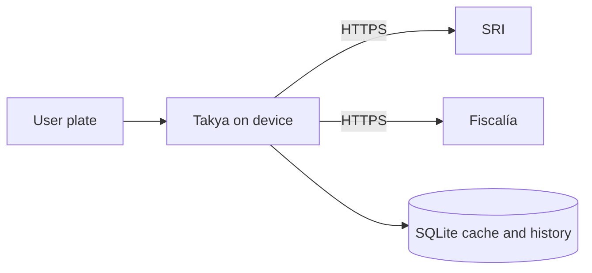

# Takya | iOS & Android

[](https://github.com/Ilchampo/takya-app/actions/workflows/ci.yml)
[](LICENSE)
[](https://expo.dev)
[](https://www.typescriptlang.org)

**Conoce el vehículo. Elige con información.**

Takya is a free iOS and Android app for Ecuador. Enter a license plate and the
device looks up public records from the SRI and the Fiscalía General del Estado
so people can know more about a vehicle before they get in.

No accounts. No ads. No Takya backend sitting between the user and the public
sources.

[takya.app](https://takya.app) · App Store and Google Play listings coming soon

<p align="center">
  <a href="https://takya.app">
    
  </a>
</p>

<p align="center"><sub>Landing page at <a href="https://takya.app">takya.app</a>. Takya is not an official Government of Ecuador application.</sub></p>

## Why it exists

In Ecuador, a plate is often the only thing you see before getting into a taxi,
a ride, or another vehicle. That plate is also the key to public records that
already exist: make, model, and color from the SRI, and whether the Fiscalía has
recent _noticias del delito_ tied to the plate.

Takya does not create those records. It makes them reachable in the moment they
matter, from a phone, without asking the user to create an account or send their
history to a private server.

| What the user does                     | What Takya shows                                     |
| -------------------------------------- | ---------------------------------------------------- |
| Types an Ecuadorian plate (`ABC-1234`) | Vehicle make, model, plate, and color from the SRI   |
| Confirms the lookup                    | Fiscalía incident summaries from the last 24 months  |
| Comes back later                       | Up to five recent queries, stored only on the device |

Availability and freshness always depend on each government source. Takya is an
independent product from [Astrobit, LLC](https://www.goastrobit.com).

## Privacy by design

Takya is built so Astrobit never needs a copy of what people look up.

- Lookups leave the phone over HTTPS, straight to the official SRI and Fiscalía
  hosts. There is no Takya API that stores plates, results, or search history.
- Version 1.0.0 does not send analytics, crash reports, or other telemetry.
- Only fields the UI actually renders are kept locally. Identity document numbers
  are dropped. Person names from Fiscalía records are masked before they are
  shown or cached.
- Cached lookups live in SQLite on the device, expire after three days, and can
  be deleted from the app at any time.
- Client-side rate limits, timeouts, retries, and response-size caps keep the
  public sources from being hammered.

If telemetry is introduced later, events must use an explicit field allowlist.
License plates, names, identity documents, incident payloads, endpoint query
strings, and cached responses must never appear in telemetry, logs, issues,
fixtures, or screenshots.

To report a vulnerability, see [SECURITY.md](SECURITY.md). Do not file a public
issue.

## Stack

A React Native app on Expo's New Architecture. Strict TypeScript, local-first
storage, and production builds through EAS.

| Layer    | Choice                                                                 |
| -------- | ---------------------------------------------------------------------- |
| Runtime  | Expo SDK 57, React Native 0.86, React 19, New Architecture             |
| Language | TypeScript (`strict`, `noUncheckedIndexedAccess`)                      |
| Storage  | `expo-sqlite` on device (history, cache, theme)                        |
| Network  | Direct HTTPS to government hosts, with retries and rate limits         |
| UI       | Custom theme (light/dark), Spanish copy, Ecuadorian plate input        |
| Quality  | Jest + Testing Library, ESLint, Prettier, Husky, GitHub Actions        |
| E2E      | Maestro flows against `com.astrobit.takya` (optional locally)          |
| Release  | EAS Build, remote iOS/Android versioning, auto-increment on production |

## Architecture

```text
src/
  screens/      Home, result, history, legal, splash, error
  components/   Plate input, vehicle details, incident list, theme chrome
  hooks/        App orchestration, search, saved lookups, theme
  lib/          Government clients, SQLite, privacy projections, config
  data/         Legal documents and debug fixtures
  theme/        Palettes, type, spacing
```

A lookup is a short pipeline on the device:

1. The plate is normalized to the Ecuadorian `ABC1234` / `ABC-1234` form.
2. SRI and Fiscalía are queried in parallel. Debug mode (`EXPO_PUBLIC_APP_DEBUG`)
   serves fixtures `ABC-1111` through `ABC-5555` instead of the live sources.
3. Responses are projected down to UI fields. Anything else is discarded.
4. The result is cached locally and the plate is added to recent history.



Contributors should keep that boundary intact: new UI can read local state;
it should not introduce a Takya-hosted store of lookups.

## Getting started

You need [Node.js](https://nodejs.org/) 22.13 or newer (see `.nvmrc`). The full
setup, scripts, and review checklist live in [CONTRIBUTING.md](CONTRIBUTING.md).

```sh
git clone https://github.com/Ilchampo/takya-app.git
cd takya-app
cp .env.example .env
npm ci
npm start
```

Then open the project in Expo Go or an iOS/Android simulator. `.env.example`
already points at the public government endpoints and enables debug lookups so
you can exercise the UI without calling live services.

| Command            | What it does                                     |
| ------------------ | ------------------------------------------------ |
| `npm start`        | Expo development server                          |
| `npm test`         | Unit tests                                       |
| `npm run test:e2e` | Maestro end-to-end tests (not run in CI)         |
| `npm run ci`       | Same checks GitHub Actions runs on pull requests |

## Store builds

`eas.json` injects the official SRI and Fiscalía HTTPS endpoints, plus app
defaults including `EXPO_PUBLIC_APP_INCIDENT_MONTHS`. Native versioning is stored
remotely by EAS (`appVersionSource: "remote"`). Production builds auto-increment
`ios.buildNumber` and `android.versionCode` on Expo's servers, so those values
do not need to be committed after each upload.

Production store uploads are maintainer-only. Contributors do not need Expo
production credentials.

## Contributing

Contributions are welcome. Please read [CONTRIBUTING.md](CONTRIBUTING.md) and
the [Code of Conduct](CODE_OF_CONDUCT.md) before opening an issue or pull
request.

By contributing, you agree that your work is licensed under GPL-3.0.

Good first surfaces: copy and accessibility, empty/error states, tests around
privacy projections, and anything that makes a lookup clearer without collecting
more data.

## License

Takya is licensed under the [GNU General Public License v3.0](LICENSE).

## Legal

- [Privacy Policy](.github/PRIVACY_POLICY.md)
- [Terms of Service](.github/TERMS_OF_SERVICE.md)
- [takya.app](https://takya.app)
